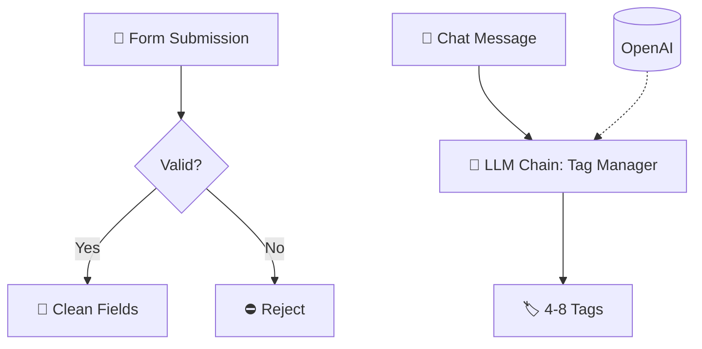

# Form Validation + AI Tag Generator

  
  
  

> Validate form submissions and auto-generate smart AI tags from Q&A content.

## ✨ Features

- ✅ Automatic field validation on every submission
- 🏷️ AI-generated 4–8 short, relevant tags per entry
- 💬 Chat-triggered tagging for Q&A style inputs
- 🧹 Clean, structured output fields — no manual cleanup

## 🔄 How it works

1. An **n8n Form trigger** collects the submission and an **IF node** validates the fields.
2. Valid entries are cleaned up with **Edit Fields** nodes.
3. A **chat trigger** feeds questions & answers into an **LLM Chain** (OpenAI chat model) acting as a *Tag Manager*.
4. The AI returns **4–8 short, relevant tags** per submission — perfect for categorization and search.

## 🧰 Requirements

| Requirement | Purpose |
|-------------|---------|
| n8n | Workflow automation |
| OpenAI API | Tag generation (LLM Chain) |

## 🚀 Setup

1. Import `workflow.json` into n8n (**Workflows → Import from File**).
2. Reconnect your **OpenAI** credential on the chat model node.
3. Open the form trigger's **Test URL**, submit a sample, and verify tags are generated.
4. Activate the workflow when ready.

## 📁 Files

| File | Description |
|------|-------------|
| `workflow.json` | Ready-to-import n8n workflow (**Workflows → Import from File**) |
| `README.md` | This guide |

> ⚠️ n8n exports never include credentials — reconnect your own after import.
