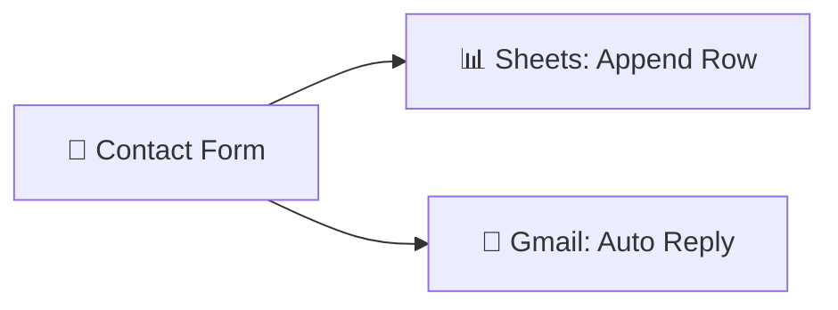

# Contact Form → Google Sheets + Auto Email

  
  
  

> Capture contact-form leads in Google Sheets and instantly send a confirmation email.

## ✨ Features

- 📝 Zero-code contact form hosted by n8n
- 📊 Every lead appended to Google Sheets in real time
- 📧 Instant personalized confirmation email to the submitter
- ⚡ Only 3 nodes — dead simple to maintain

## 🔄 How it works

1. An **n8n Form trigger** fires on every submission.
2. **Google Sheets** appends the lead as a new row.
3. **Gmail** immediately sends a confirmation/auto-reply to the submitter.

## 🧰 Requirements

| Requirement | Purpose |
|-------------|---------|
| n8n | Workflow automation |
| Google Sheets | Lead storage |
| Gmail | Auto-reply |

## 🚀 Setup

1. Import `workflow.json` into n8n.
2. Create a Google Sheet and connect the **Google Sheets** credential; map the columns.
3. Connect your **Gmail** credential and customize the reply subject/body.
4. Test with the form URL, then activate.

## 📁 Files

| File | Description |
|------|-------------|
| `workflow.json` | Ready-to-import n8n workflow (**Workflows → Import from File**) |
| `README.md` | This guide |

> ⚠️ n8n exports never include credentials — reconnect your own after import.
