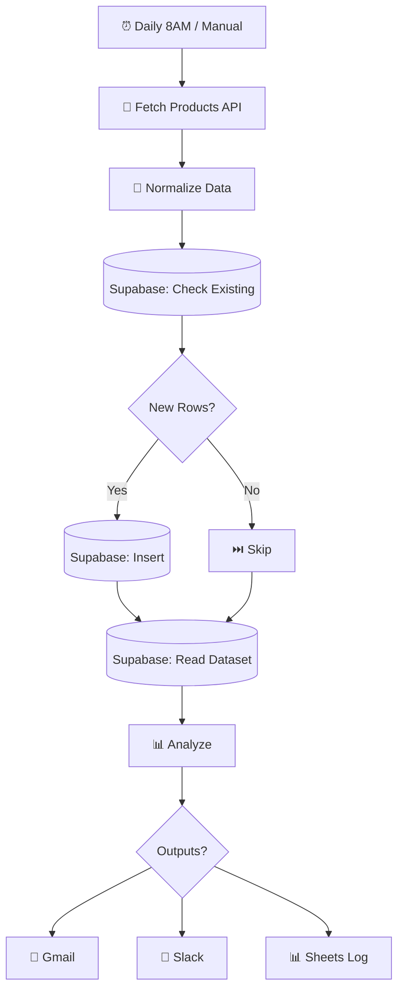

# QuickMart API → Supabase + Data Analysis

  
  
  

> Daily product-data ingestion from a public API into Supabase, with snapshot history, analysis and multi-channel reporting.

## ✨ Features

- ⏰ Fully automatic daily 8:00 AM run (+ manual trigger for testing)
- 🗄️ Supabase snapshot history with duplicate protection
- 📊 Rich analysis: avg price, ratings, categories, high-value items, trend vs previous day
- 🔔 Toggleable Gmail / Slack / Google Sheets reporting
- 🛡️ Safe testing mode — notifications OFF by default

## 🔄 How it works

1. **Trigger:** manual run or automatic **daily 8:00 AM** schedule.
2. **Ingestion:** products are fetched from the Fake Store API and normalized (one item per product, tagged with run ID/date).
3. **Database:** today's existing rows are read first; only missing `(product_id, run_date)` snapshots are inserted — no same-day duplicates, full day-to-day history preserved.
4. **Analysis:** runs on data read back from Supabase — total products, high-value (>$50) items, average price, average rating, category breakdown, electronics count, and previous-vs-latest snapshot comparison.
5. **Distribution:** optional Gmail, Slack and Google Sheets outputs, each toggled in `CONFIG - Settings` (all OFF by default for safe testing).

## 🧰 Requirements

| Requirement | Purpose |
|-------------|---------|
| n8n | Workflow automation |
| Supabase | Postgres snapshots |
| Gmail / Slack / Google Sheets | Optional reporting (toggleable) |

## 🚀 Setup

1. Run the provided `quickmart_supabase_schema.sql` in the Supabase SQL Editor.
2. Create a **Supabase credential** in n8n (Project URL + service-role key) and assign it to all Supabase nodes.
3. In `CONFIG - Settings`, replace the email / channel / sheet placeholders.
4. Connect Gmail / Slack / Google Sheets only for the outputs you enable.
5. Start with the Manual Trigger; after testing, activate the workflow for the daily schedule.

## 📁 Files

| File | Description |
|------|-------------|
| `workflow.json` | Ready-to-import n8n workflow (**Workflows → Import from File**) |
| `README.md` | This guide |

> ⚠️ n8n exports never include credentials — reconnect your own after import.
