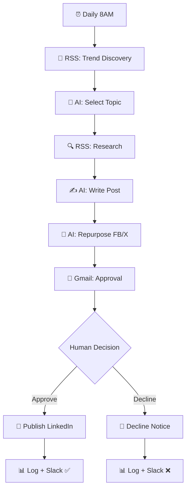

# LinkedIn AI Content Pipeline

  
  
  

> End-to-end AI content engine: trend discovery → AI-written LinkedIn posts → human approval → auto-publish + repurposing.

## ✨ Features

- 📰 Automatic trend discovery via Google News RSS (no paid API)
- 🤖 3-stage AI pipeline: topic selection → post writing → repurposing
- 🧠 Memory-aware topic picker avoids repeating recent topics
- ✋ Human-in-the-loop Gmail approval with APPROVE / DECLINE buttons
- 🔁 Auto-repurposes posts for Facebook + X
- 📊 Full audit log in Google Sheets + Slack notifications

## 🔄 How it works

1. **Trigger:** manual or **daily 8:00 AM** schedule.
2. **Trend discovery:** Google News RSS feeds surface trending topics (no paid SerpAPI key needed).
3. **AI Agent (topic selection):** picks the strongest topic with memory of past choices.
4. **Research:** RSS research gathers source links for the chosen topic.
5. **AI Agent (writer):** drafts the LinkedIn post with hashtags, plus an image idea and alt text.
6. **AI Agent (repurpose):** creates Facebook + X versions of the post.
7. **Human approval:** Gmail *Send-and-Wait* with **APPROVE / DECLINE** buttons pauses the workflow until you decide.
8. **Publish or decline:** approved posts go live via the LinkedIn node; declines trigger a notification — both paths are logged to Google Sheets and announced on Slack.

## 🧰 Requirements

| Requirement | Purpose |
|-------------|---------|
| n8n | Workflow automation |
| OpenAI API | Topic selection, writing, repurposing |
| Gmail | Human approval step |
| LinkedIn | Auto-publishing |
| Google Sheets + Slack | Logging & notifications |

## 🚀 Setup

1. Import `workflow.json` into n8n.
2. In `CONFIG - Settings`, enter your approval email, Google Sheet ID/tab and Slack channel.
3. Reconnect all three **OpenAI Chat Model** nodes plus Gmail, Slack, Google Sheets and LinkedIn credentials.
4. Create the `LinkedIn_Log` tab with headers: `timestamp | topic | post_text | hashtags | approval_status | linkedin_urn | image_idea | alt_text | facebook_version | x_version | selected_reason | source_links`.
5. Keep the workflow inactive while testing — try APPROVE and DECLINE paths separately, then activate.

## 📁 Files

| File | Description |
|------|-------------|
| `workflow.json` | Ready-to-import n8n workflow (**Workflows → Import from File**) |
| `README.md` | This guide |

> ⚠️ n8n exports never include credentials — reconnect your own after import.
