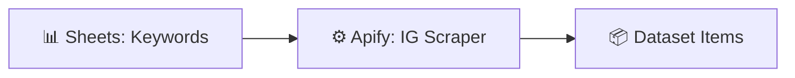

# Instagram Keyword Search + Data Collection

  
  
  

> Scrape Instagram posts by keyword with Apify and collect the dataset for research or outreach.

## ✨ Features

- 🔍 Keyword-driven Instagram scraping via Apify
- 📊 Keywords managed conveniently in Google Sheets
- 📦 Structured dataset output, ready for analysis or outreach

## 🔄 How it works

1. Keywords are read from a **Google Sheet**.
2. The **Apify Instagram Keyword Search Scraper** actor runs per keyword (up to 6 posts each).
3. Dataset items are retrieved and ready for downstream processing or export.

## 🧰 Requirements

| Requirement | Purpose |
|-------------|---------|
| n8n | Workflow automation |
| Apify | Instagram scraping actor |
| Google Sheets | Keyword input |

## 🚀 Setup

1. Import `workflow.json` into n8n.
2. Connect your **Apify** credential and add keywords to the source Google Sheet (column `Search keyword`).
3. Run manually once to verify the actor output, then schedule or trigger as needed.

## 📁 Files

| File | Description |
|------|-------------|
| `workflow.json` | Ready-to-import n8n workflow (**Workflows → Import from File**) |
| `README.md` | This guide |

> ⚠️ n8n exports never include credentials — reconnect your own after import.
