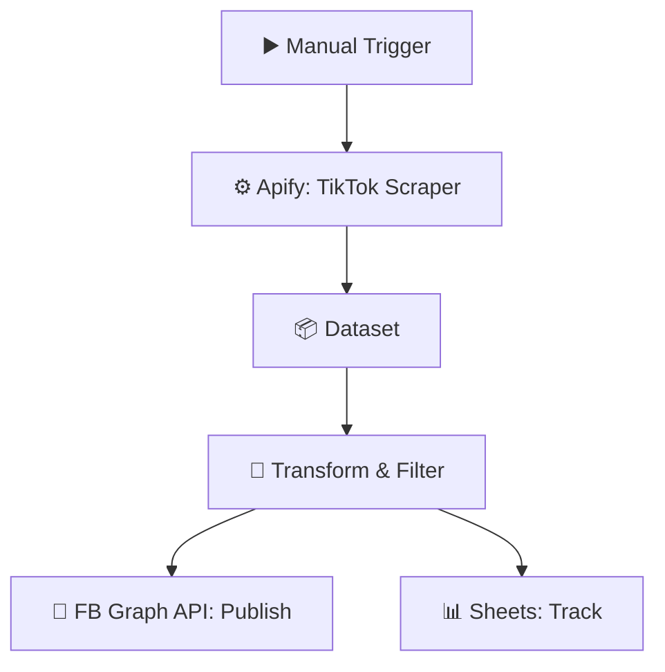

# TikTok → Facebook Automation (Apify)

  
  
  

> Scrape TikTok content with Apify and republish it to Facebook automatically via the Graph API.

## ✨ Features

- 🎵 TikTok content scraping via Apify actor
- 🧹 Code-node transformation & filtering
- 📘 Direct publishing to Facebook via Graph API
- 📊 Google Sheets tracking of processed items

## 🔄 How it works

1. The **Apify TikTok Scraper** actor collects trending/post data.
2. A **Code node** transforms and filters the dataset items.
3. An **HTTP Request** publishes the content to Facebook through the **Graph API**.
4. A **Google Sheet** tracks what's been processed.

## 🧰 Requirements

| Requirement | Purpose |
|-------------|---------|
| n8n | Workflow automation |
| Apify | TikTok scraping actor |
| Facebook Graph API | Publishing |
| Google Sheets | Tracking |

## 🚀 Setup

1. Import `workflow.json` into n8n.
2. Connect **Apify** and configure the TikTok scraper actor input.
3. Add your Facebook Page access token to the Graph API HTTP node.
4. Point the Google Sheets node at your tracking sheet, test once, then activate.

## 📁 Files

| File | Description |
|------|-------------|
| `workflow.json` | Ready-to-import n8n workflow (**Workflows → Import from File**) |
| `README.md` | This guide |

> ⚠️ n8n exports never include credentials — reconnect your own after import.
