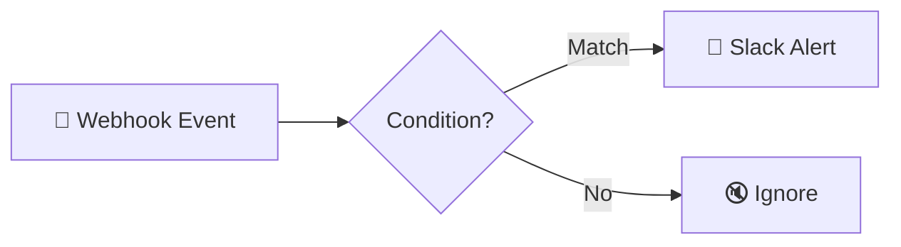

# Webhook → Slack Notification Automation

  
  
  

> Turn any webhook event into an instant, conditional Slack alert.

## ✨ Features

- 🔗 Works with webhooks from any service
- 🎯 Conditional filtering — only important events notify
- 💬 Instant formatted Slack alerts
- ⚡ Lightweight 3-node setup

## 🔄 How it works

1. A **Webhook node** receives incoming events (test or production URL).
2. An **IF node** filters/conditions which events deserve a notification.
3. Matching events are pushed to **Slack** as a formatted message.

## 🧰 Requirements

| Requirement | Purpose |
|-------------|---------|
| n8n | Workflow automation |
| Slack | Notifications |
| Any webhook source | Event input |

## 🚀 Setup

1. Import `workflow.json` into n8n.
2. Connect your **Slack** credential and choose the target channel.
3. Copy the production webhook URL into the sending service.
4. Send a test event, verify the Slack message, then activate.

## 📁 Files

| File | Description |
|------|-------------|
| `workflow.json` | Ready-to-import n8n workflow (**Workflows → Import from File**) |
| `README.md` | This guide |

> ⚠️ n8n exports never include credentials — reconnect your own after import.
