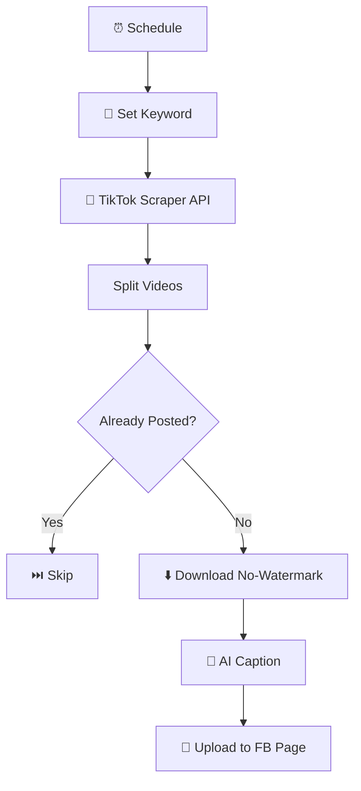

# TikTok → Facebook Page Automation

  
  
  

> Scheduled TikTok discovery with duplicate detection, no-watermark downloads and AI-written captions, auto-posted to a Facebook Page.

## ✨ Features

- ⏰ Scheduled, hands-free operation
- 🔍 Keyword-based TikTok video discovery
- 🛡️ Duplicate detection — never reposts the same video
- ⬇️ No-watermark video downloads
- ✍️ AI-written captions via OpenAI
- 📘 Native Facebook Page publishing via Graph API

## 🔄 How it works

1. **Schedule trigger** kicks off the run; a **Set node** defines the search keyword.
2. TikTok videos are fetched via a **RapidAPI TikTok scraper** endpoint.
3. Videos are split out and looped in batches; each is checked against the **Facebook Page** — already-posted videos are skipped.
4. New videos are downloaded **without watermark**, then **OpenAI generates a caption**.
5. The video + caption are uploaded to the Facebook Page via the **Graph API**.

## 🧰 Requirements

| Requirement | Purpose |
|-------------|---------|
| n8n | Workflow automation |
| RapidAPI | TikTok scraper endpoint |
| OpenAI API | Caption generation |
| Facebook Graph API | Page publishing |

## 🚀 Setup

1. Import `workflow.json` into n8n.
2. Replace the TikTok Search node with your chosen RapidAPI scraper endpoint + key.
3. Connect **OpenAI** and set your Facebook Page token / Page ID in the Graph API nodes.
4. Run once manually to confirm dedupe + upload work, then activate the schedule.

## 📁 Files

| File | Description |
|------|-------------|
| `workflow.json` | Ready-to-import n8n workflow (**Workflows → Import from File**) |
| `README.md` | This guide |

> ⚠️ n8n exports never include credentials — reconnect your own after import.
