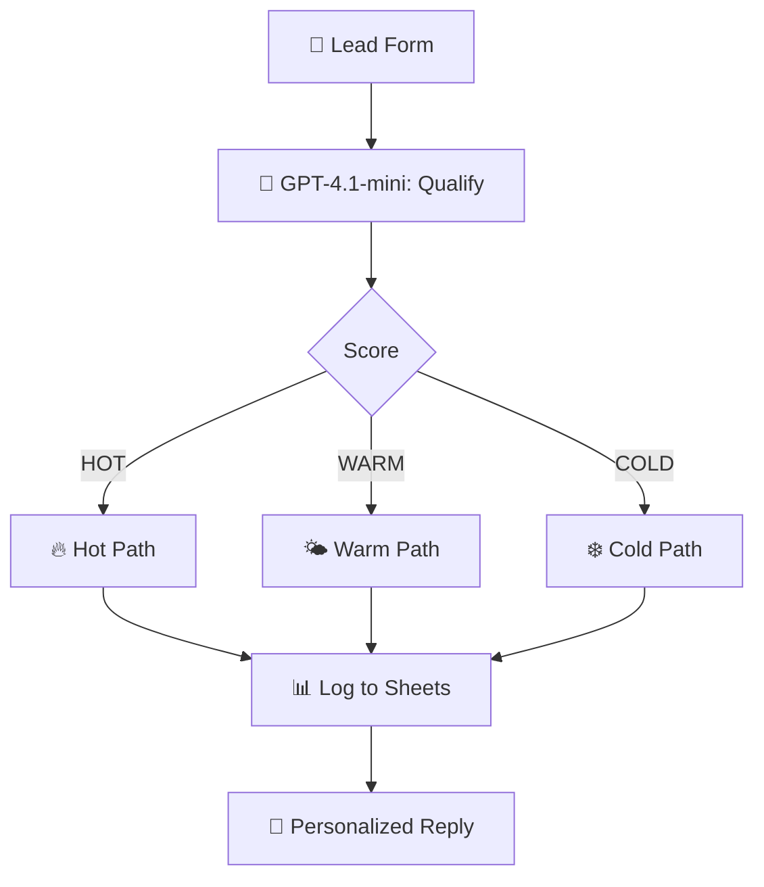

# AI Lead Qualification Automation

  
  
  

> Score inbound leads HOT / WARM / COLD with GPT-4.1-mini, route them, log to Sheets and auto-send a personalized reply.

## ✨ Features

- 🤖 GPT-4.1-mini scores every lead 1–10 and classifies HOT / WARM / COLD
- 🔀 Smart routing with tailored handling per tier
- 📊 Complete lead log in Google Sheets (score, summary, recommended action)
- 📧 Personalized auto-reply matched to qualification tier

## 🔄 How it works

1. A **Lead Form** captures name, email, company, service, budget, timeline and project description.
2. An **HTTP call to OpenAI** (`gpt-4.1-mini`) classifies each lead as **HOT / WARM / COLD** with a 1–10 score, a summary and a recommended action.
3. A **Switch node** routes HOT, WARM and COLD leads down tailored paths.
4. Every lead is appended to **Google Sheets** with its score, status and AI summary.
5. **Gmail** sends a personalized reply written for that lead's qualification tier.

## 🧰 Requirements

| Requirement | Purpose |
|-------------|---------|
| n8n | Workflow automation |
| OpenAI API | GPT-4.1-mini lead scoring |
| Google Sheets | Lead log |
| Gmail | Personalized replies |

## 🚀 Setup

1. Import `workflow.json` into n8n.
2. In **OpenAI - Qualify Lead**, select your OpenAI API credential.
3. Create a spreadsheet with a `Leads` tab and headers: `Timestamp | Name | Email | Company | Service | Budget | Timeline | Project Description | AI Score | Lead Status | AI Summary | Recommended Action | Route Action | Email Subject | Email Reply`.
4. Connect Google Sheets + Gmail credentials, test with a sample lead, then activate.

## 📁 Files

| File | Description |
|------|-------------|
| `workflow.json` | Ready-to-import n8n workflow (**Workflows → Import from File**) |
| `README.md` | This guide |

> ⚠️ n8n exports never include credentials — reconnect your own after import.
