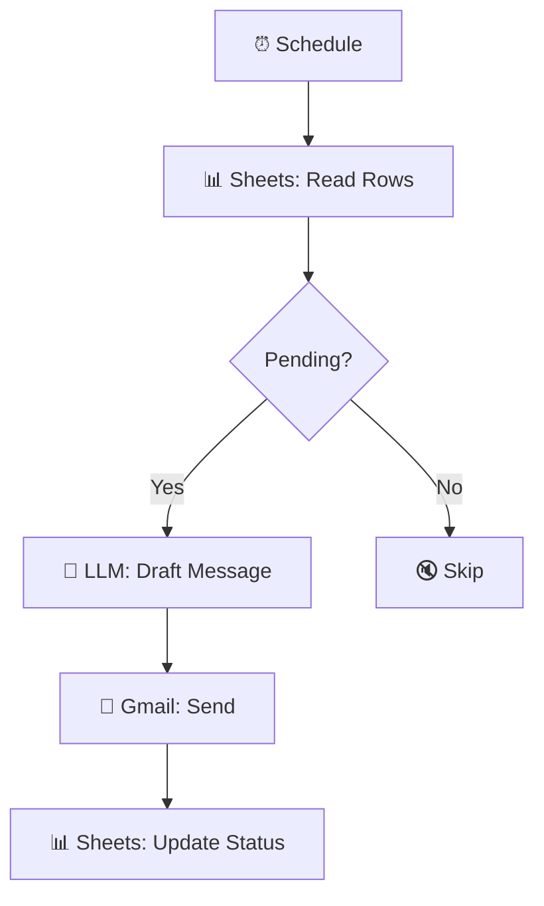

# AI Student Acknowledgement + Status Tracking

  
  
  

> Scheduled AI-generated acknowledgement emails for students, with status tracking in Google Sheets.

## ✨ Features

- ⏰ Scheduled batch processing
- 🤖 LLM-drafted personalized acknowledgement messages
- 📧 Automatic Gmail delivery
- 📊 Status written back to Google Sheets — full tracking loop

## 🔄 How it works

1. A **Schedule trigger** runs the workflow periodically.
2. **Google Sheets** rows are read and filtered with an **IF node** (e.g. pending acknowledgements).
3. An **LLM Chain** (OpenAI) drafts a personalized acknowledgement message per student.
4. **Gmail** sends the message; the sheet row is then **updated** with the sent status.

## 🧰 Requirements

| Requirement | Purpose |
|-------------|---------|
| n8n | Workflow automation |
| OpenAI API | Message drafting (LLM Chain) |
| Google Sheets | Student data + status |
| Gmail | Sending |

## 🚀 Setup

1. Import `workflow.json` into n8n.
2. Point the Google Sheets nodes at your student spreadsheet and reconnect credentials.
3. Reconnect the **OpenAI** chat model inside the LLM Chain.
4. Run once manually to verify emails + status updates, then activate the schedule.

## 📁 Files

| File | Description |
|------|-------------|
| `workflow.json` | Ready-to-import n8n workflow (**Workflows → Import from File**) |
| `README.md` | This guide |

> ⚠️ n8n exports never include credentials — reconnect your own after import.
